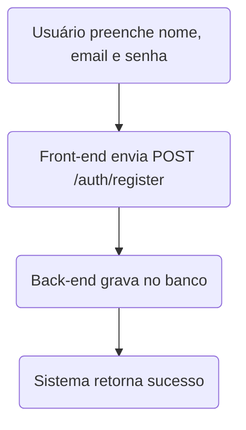
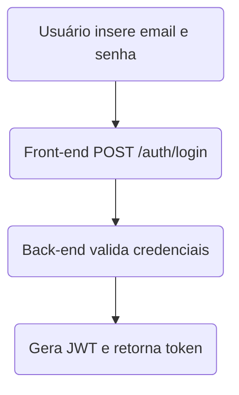
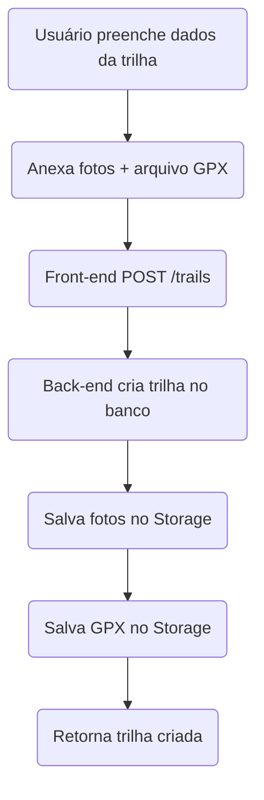
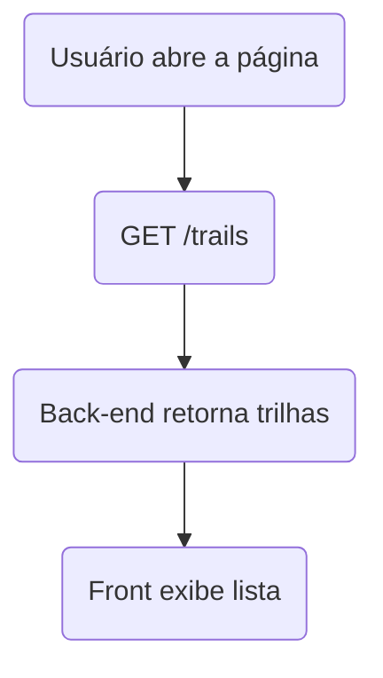
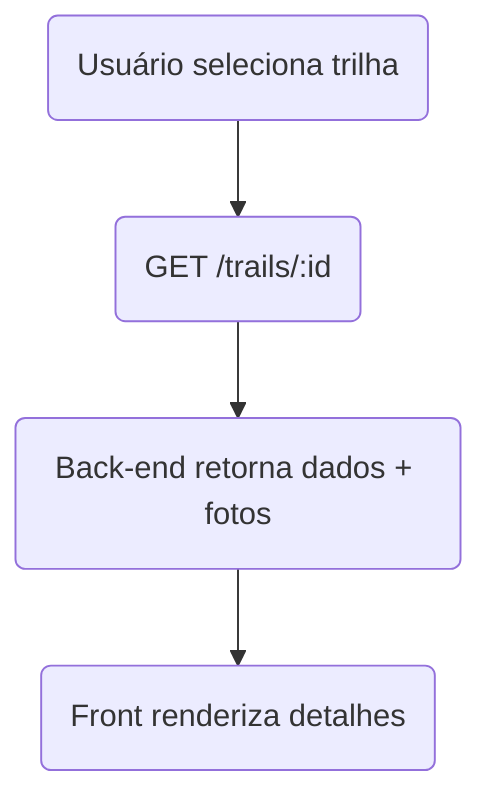
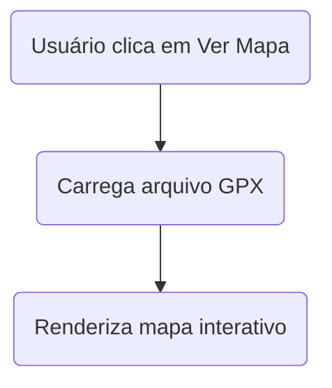
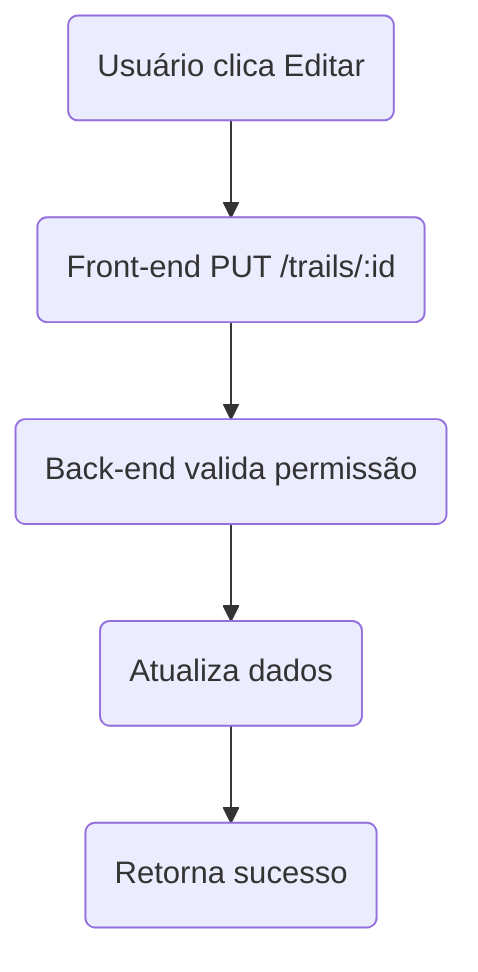
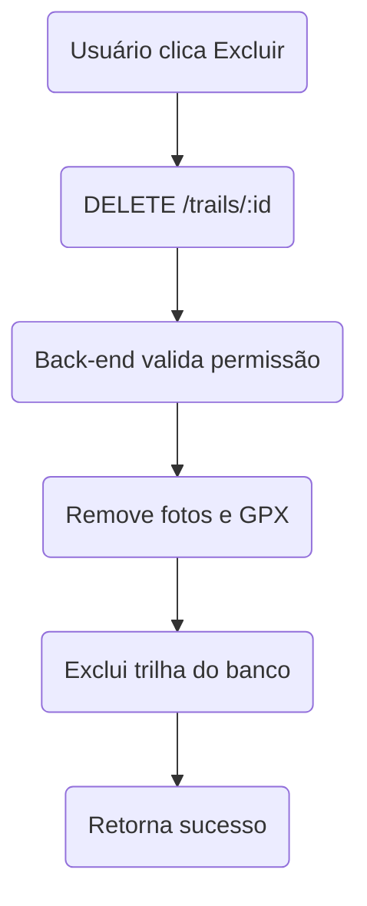

%% UC1 — Cadastrar Usuário

%% UC2 — Login

%% UC3 — Cadastrar Trilha

%% UC4 — Listar Trilhas

%% UC5 — Visualizar Detalhes

%% UC6 — Exibir Mapa da trilha

%% UC8 — Editar Trilha

%% UC9 — Excluir Trilha

