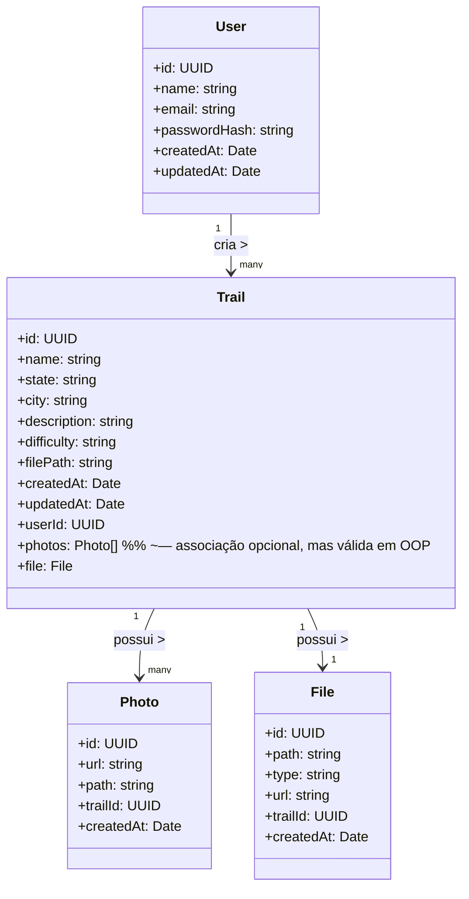

```mermaid
classDiagram
direction TB
    class User {
	    +id: UUID
	    +name: string
	    +email: string
	    +passwordHash: string
	    +createdAt: Date
	    +updatedAt: Date
    }
    class Trail {
	    +id: UUID
	    +name: string
	    +state: string
	    +city: string
	    +description: string
	    +difficulty: string
	    +filePath: string
	    +createdAt: Date
	    +updatedAt: Date
	    +userId: UUID
	    +photos: Photo[]    %% ~— associação opcional, mas válida em OOP
	    +file: File
    }
    class Photo {
	    +id: UUID
	    +url: string
	    +path: string
	    +trailId: UUID
	    +createdAt: Date
    }
    class File {
	    +id: UUID
	    +path: string
	    +type: string
	    +url: string
	    +trailId: UUID
	    +createdAt: Date
    }
    User "1" --> "many" Trail : cria >
    Trail "1" --> "many" Photo : possui >
    Trail "1" --> "1" File : possui >
```

**Atualizado em:** 🗓️ *31/10/2025* — **Ricardo**
