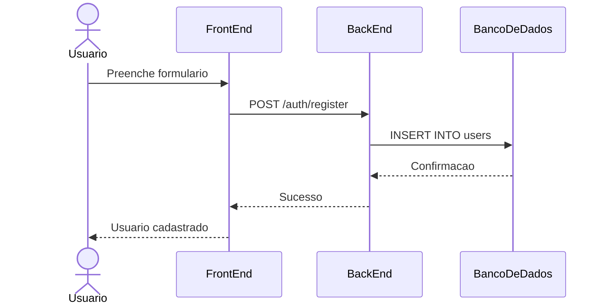
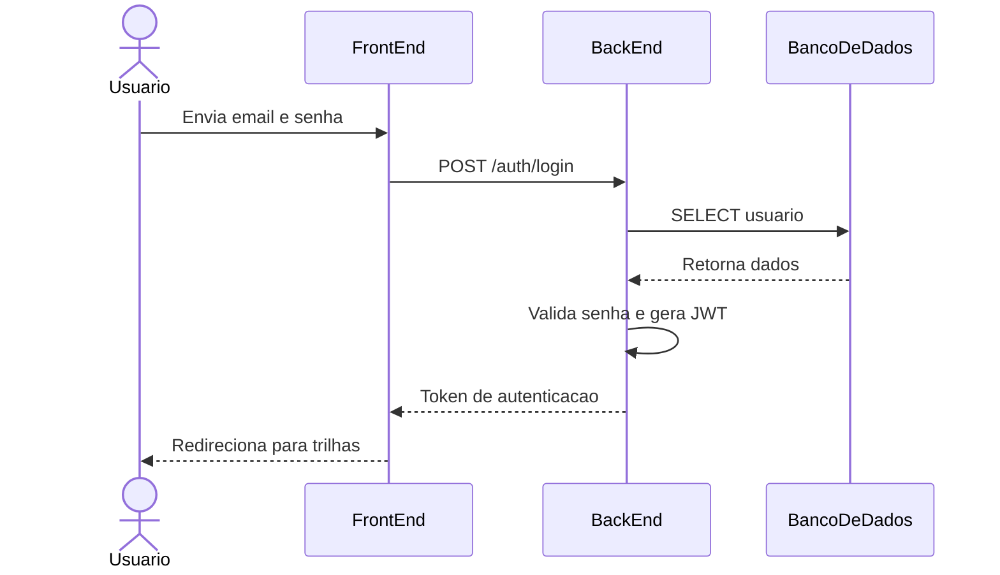
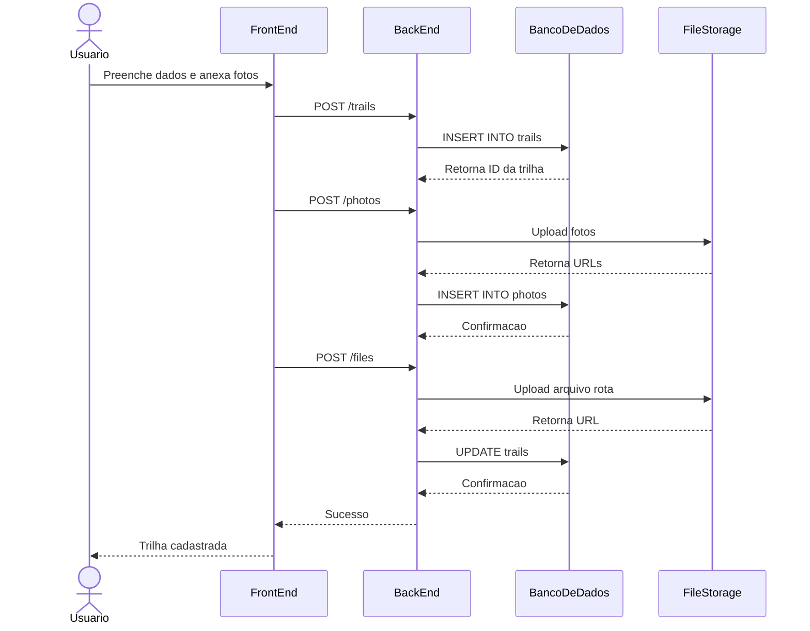
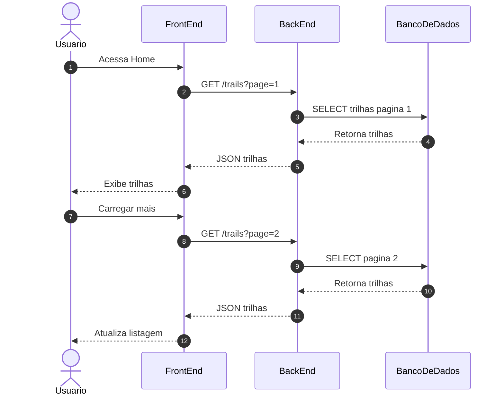
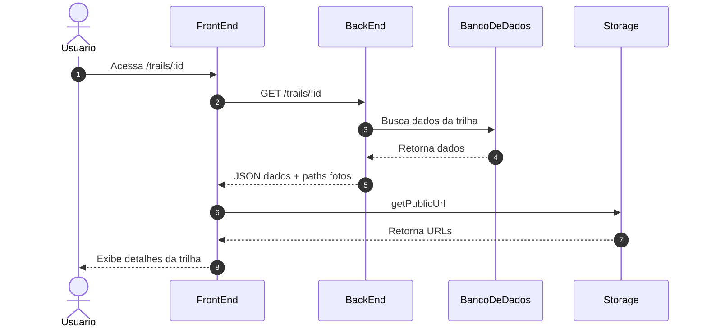
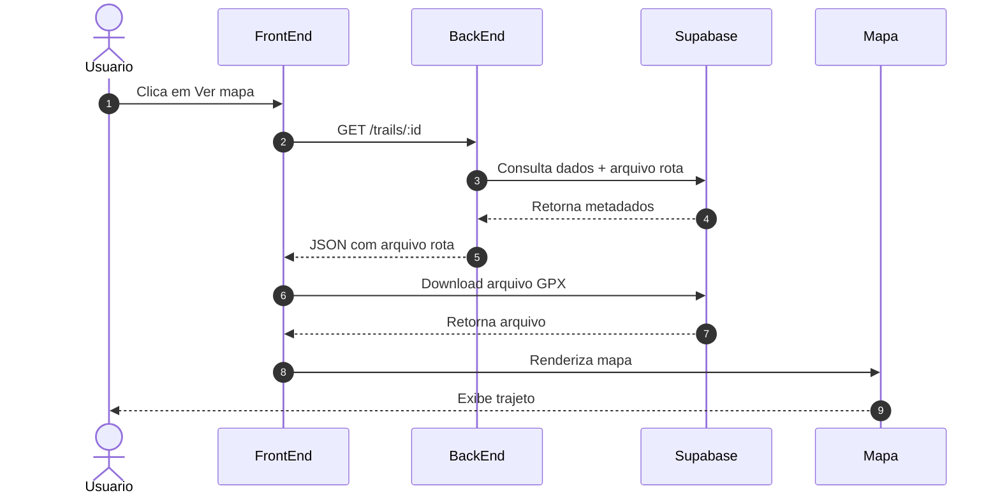
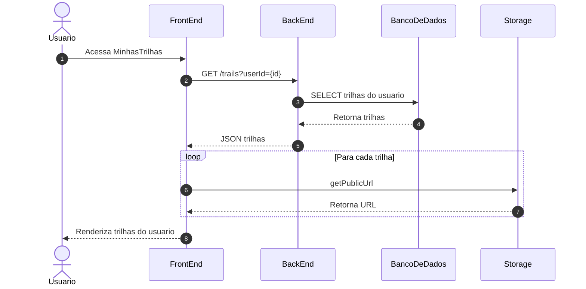
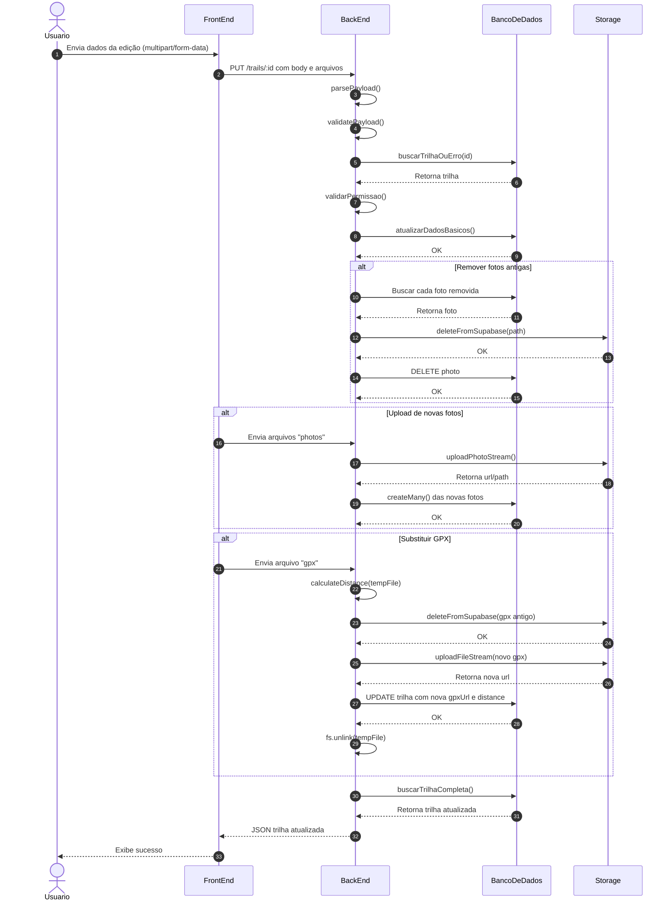
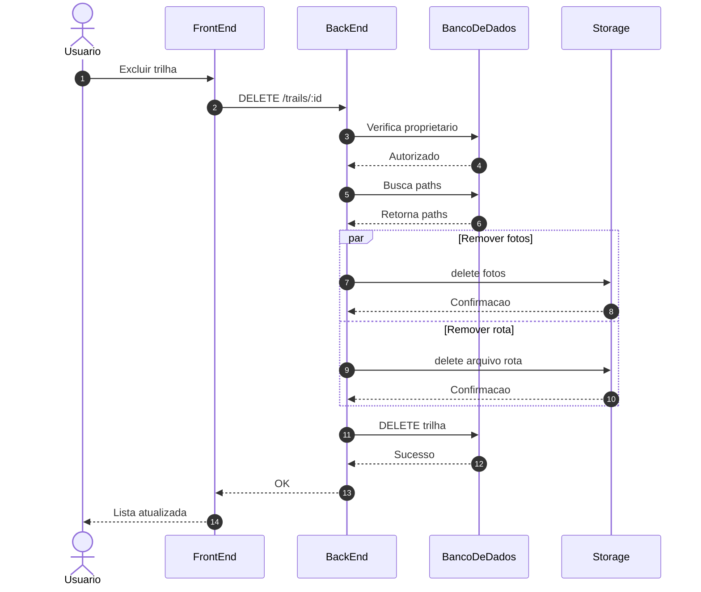

%% Diagrama de sequência: 1.Cadastro de Usuário

%% Diagrama de sequência: 2.Login do Usuário

%% Diagrama de sequência: 3.Cadastro de Trilha (com Upload Múltiplo de Fotos)

%% Diagrama de sequência: 4.Listagem de Trilhas com Filtro

%% Diagrama de sequência: 5.Exibir Detalhes da trilha

%% Diagrama de sequência: 6.(Futuro) Exibir Mapa Interativo

%% Diagrama de sequência: 7.Listar Trilhas do Usuário Logado

%% Diagrama de sequência: 8.Editar Trilha 

%% Diagrama de sequência: 9.Deletar trilha

