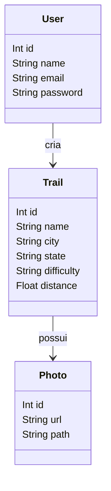
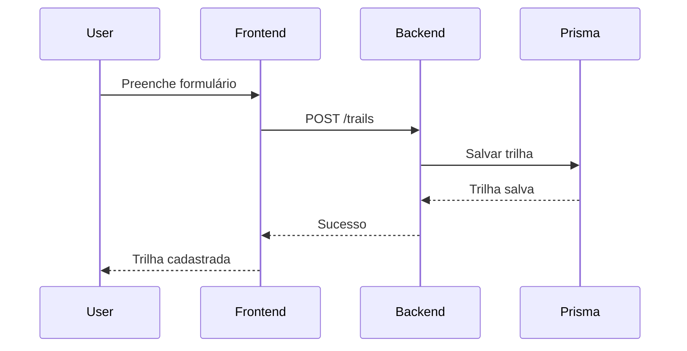

# Documentação Final do Projeto  
## **Trilha Conectada**

**Equipe:** Fernanda Bittencourt, Grazielle Carvalho e Ricardo Junior Pereira da Silva
**Disciplina:** Projeto Integrador 2  
**Instituição:** IFCE – Campus Maranguape  
**Semestre:** 2025.2  

---

# Sumário
1. [Introdução](#1-introdução)  
2. [Visão Geral do Sistema](#2-visão-geral-do-sistema)  
3. [Requisitos do Sistema](#3-requisitos-do-sistema)  
4. [Arquitetura e Tecnologias Utilizadas](#4-arquitetura-e-tecnologias-utilizadas)  
5. [Diagramas do Sistema](#5-diagramas-do-sistema)  
6. [Descrição dos Módulos e Componentes](#6-descrição-dos-módulos-e-componentes)  
7. [Guia de Instalação e Execução](#7-guia-de-instalação-e-execução)  
8. [Manual do Usuário](#8-manual-do-usuário)  
9. [Decisões de Projeto e Limitações](#9-decisões-de-projeto-e-limitações)  
10. [Testes Unitários com Jest](#10-testes-unitários-com-jest)  
11. [Referências](#11-referências)

---

# 1. Introdução

## 1.1 Objetivo do Documento
Este documento reúne toda a documentação técnica e de usuário do sistema **Trilha Conectada**, desenvolvido como parte da disciplina Projeto Integrador 2. 
Seu objetivo é permitir que desenvolvedores, professores e avaliadores compreendam como o sistema funciona, sua arquitetura, requisitos, tecnologias usadas, estrutura interna e modo de utilização. Também fornece instruções de instalação e execução, além de registrar decisões de projeto e apresentar os testes unitários desenvolvidos no backend.

## 1.2 Público-alvo
- Professor avaliador; 
- Desenvolvedores que pretendem estudar, manter ou expandir o sistema;
- Usuários finais.

---

# 2. Visão Geral do Sistema

## 2.1 Descrição Resumida
O **Trilha Conectada** é uma aplicação desenvolvida para praticantes de trilhas e aventureiros que desejam registrar, organizar e compartilhar rotas percorridas em diferentes regiões.  
O sistema permite o cadastro de trilhas contendo informações como nome, cidade, estado, dificuldade, distância, fotos e arquivo de rota (GPX).  

O projeto foi pensado para ser simples, acessível e útil tanto para trilheiros iniciantes quanto para experientes, oferecendo uma forma prática de documentar experiências e consultar trilhas cadastradas.

## 2.2 Funcionalidades Principais
- Cadastro de usuários;
- Login com autenticação;
- Cadastro de trilhas com fotos e arquivo GPX;
- Listagem de trilhas cadastradas; 
- Edição de trilhas;
- Exclusão de trilhas;
- Upload de fotos e arquivo GPX.

## 2.3 Escopo do Sistema
### O que o sistema faz:
- Realiza autenticação de usuários  
- Registra trilhas com dados completos  
- Armazena fotos e arquivos de rota  
- Permite editar e remover trilhas   

### O que NÃO faz (fora do escopo):
- Mapa interativo das trilhas  
- Compartilhamento público de trilhas  
- Sistema de comentários  
- Integração com redes sociais  

---

# 3. Requisitos do Sistema

## 3.1 Requisitos Funcionais
- **RF01:** O sistema deve permitir cadastrar usuários.  
- **RF02:** O sistema deve permitir login com email e senha.  
- **RF03:** O usuário autenticado deve poder cadastrar trilhas.  
- **RF04:** O usuário deve poder enviar fotos e arquivo GPX da trilha.  
- **RF05:** O sistema deve permitir listar trilhas cadastradas.  
- **RF06:** O sistema deve permitir editar trilhas existentes.  
- **RF07:** O sistema deve permitir excluir trilhas cadastradas.  
- **RF08:** O sistema deve impedir que um usuário exclua trilhas de outro usuário.  

## 3.2 Requisitos Não Funcionais
- **RNF01:** O sistema deve utilizar banco SQLite via Prisma.  
- **RNF02:** O backend deve seguir arquitetura REST.  
- **RNF03:** A interface deve ser responsiva.  
- **RNF04:** A aplicação deve utilizar autenticação JWT.  
- **RNF05:** O sistema deve utilizar Supabase Storage para arquivos.  
- **RNF06:** O tempo de resposta deve ser inferior a 2 segundos para operações comuns.  

---

# 4. Arquitetura e Tecnologias Utilizadas

## 4.1 Arquitetura Geral
O **Trilha Conectada** utiliza arquitetura **cliente-servidor**, onde:

- O **frontend** (React) é responsável pela interface gráfica e interação com o usuário.  
- O **backend** (Node.js + Express) fornece uma API REST que gerencia trilhas, usuários e arquivos.  
- A persistência é realizada com **Prisma ORM** e **SQLite**.

## 4.2 Tecnologias Utilizadas

### **Frontend**
- React  
- Vite  
- Axios  
- React Router  
- CSS Modules  

### **Backend**
- Node.js  
- Express  
- Prisma ORM  
- SQLite  
- Multer (upload local antes de enviar ao Supabase)  
- Supabase Storage  
- JWT  
- Bcrypt  

## 4.3 Padrões e Boas Práticas Adotados
- Arquitetura em camadas no backend (routes, controllers, core, utils).  
- Componentização no frontend.  
- Nomes de variáveis semânticos.  
- Separação entre lógica de negócio (core) e lógica HTTP (controllers).  
- Uso de middlewares para autenticação e logs.  

---

# 5. Diagramas do Sistema

## 5.1 Diagrama de Casos de Uso (Mermaid)
```mermaid
usecaseDiagram
actor Usuario
Usuario --> (Cadastrar trilha)
Usuario --> (Listar trilhas)
Usuario --> (Editar trilha)
Usuario --> (Excluir trilha)
Usuario --> (Fazer login)
Usuario --> (Cadastrar usuário)
```

## 5.2 Diagrama de Classes (Modelo de Dados)


## 5.3 Diagrama de Sequência – Criar Trilha


---

# 6. Descrição dos Módulos e Componentes

## 6.1 Organização das Pastas
### **Backend**
```
/backend
  /src
    /routes
    /controllers
    /core
    /middlewares
    /services
  package.json
```

### **Frontend**
```
/frontend
  /src
    /components
    /pages
    /services
  package.json
```

## 6.2 Módulos do Sistema
- **Autenticação** – cadastro e login.  
- **Trilhas** – CRUD completo de trilhas.  
- **Upload** – envio de fotos e arquivos GPX ao Supabase.  

## 6.3 Fluxo de uma Operação Importante – Criar Trilha
1. Usuário preenche formulário.  
2. Front envia `POST /trails`.  
3. Multer processa arquivos.  
4. Core valida dados.  
5. Fotos e GPX são enviados ao Supabase.  
6. Prisma salva trilha e fotos.  
7. Backend retorna sucesso.  
8. Frontend atualiza lista.

---

# 7. Guia de Instalação e Execução

## 7.1 Pré-requisitos
- Node.js 18+  
- Git  
- Conta no Supabase  

## 7.2 Como Clonar o Repositório
```
git clone https://github.com/usuario/trilha-conectada.git
cd trilha-conectada
```

## 7.3 Instalação e Execução – Backend
```
cd backend
npm install
npx prisma migrate dev
npm run dev
```
A API rodará em: **http://localhost:3000**

## 7.4 Instalação e Execução – Frontend
```
cd frontend
npm install
npm run dev
```
Disponível em: **http://localhost:5173**

## 7.5 Variáveis de Ambiente
Criar arquivo `.env` no backend:

```
DATABASE_URL="file:./dev.db"
JWT_SECRET="sua_chave"
SUPABASE_URL="..."
SUPABASE_KEY="..."
SUPABASE_BUCKET="uploads"
```

---

# 8. Manual do Usuário

## 8.1 Tela Inicial
Apresenta lista de trilhas cadastradas pelo usuário.

## 8.2 Login e Cadastro
- Informe nome, email e senha para cadastrar.  
- No login, informe email e senha corretos.  

## 8.3 Cadastro de Trilhas
1. Clique em “Cadastrar Trilha”.  
2. Preencha os campos obrigatórios.  
3. Adicione fotos e arquivo GPX.  
4. Clique em “Salvar”.

## 8.4 Edição e Exclusão
- Na lista, clique em “Editar” para modificar campos.  
- Clique em “Excluir” para remover uma trilha.  

## 8.5 Erros Comuns
- **Campos faltando** → preencha todos os campos.  
- **Erro de autenticação** → refaça login.  
- **Erro ao enviar arquivo** → verifique formato.

---

# 9. Decisões de Projeto e Limitações

## 9.1 Decisões Importantes
- Node + Express pela simplicidade.  
- React por ser moderno e rápido.  
- Prisma pela produtividade.  
- Supabase por oferecer storage integrado.

## 9.2 Limitações
- Não possui mapa interativo.  
- Não suporta comentários ou compartilhamento.  
- Simples sistema de permissões.

---

# 10. Testes Unitários com Jest

## 10.1 Objetivo
Validar regras de negócio do backend.

## 10.2 Tecnologias
- Jest  
- Node.js  

## 10.3 Como Executar
```
npm test
```

## 10.4 Organização
```
/backend/tests
```

## 10.5 Testes Implementados
- Validação de exclusão  
- Teste do deleteTrailCore  
- Validação de campos obrigatórios  

## 10.6 Exemplo
```js
test("deve retornar erro ao deletar trilha inexistente", () => {
  expect(() => deleteTrailCore(999)).toThrow();
});
```

## 10.7 Benefícios
- Segurança  
- Menos regressões  
- Maior confiabilidade  

---

# 11. Referências

- Documentação oficial do React  
- Documentação do Node.js  
- Prisma ORM Docs  
- Supabase Docs  
- Material da disciplina Projeto Integrador 2  

---

_Fim do documento._
